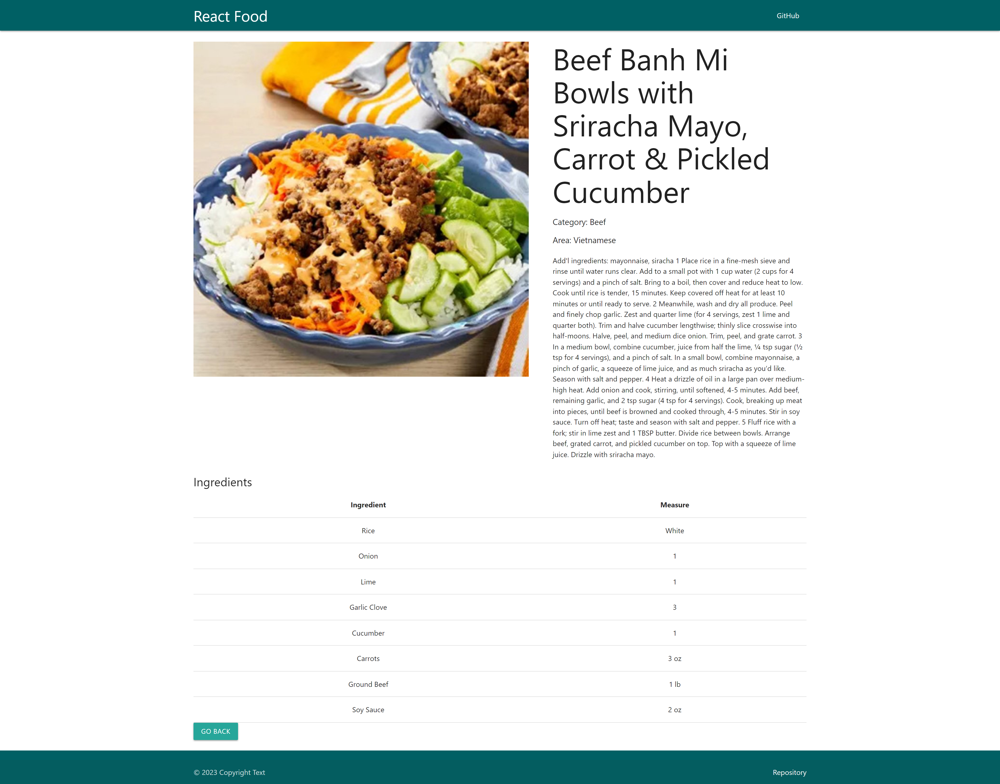
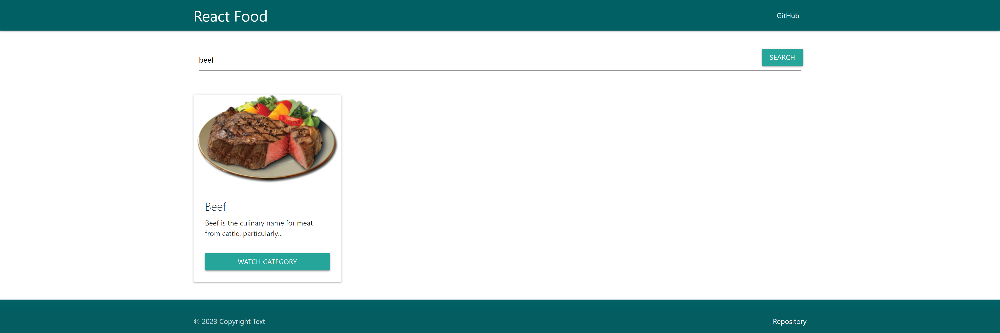
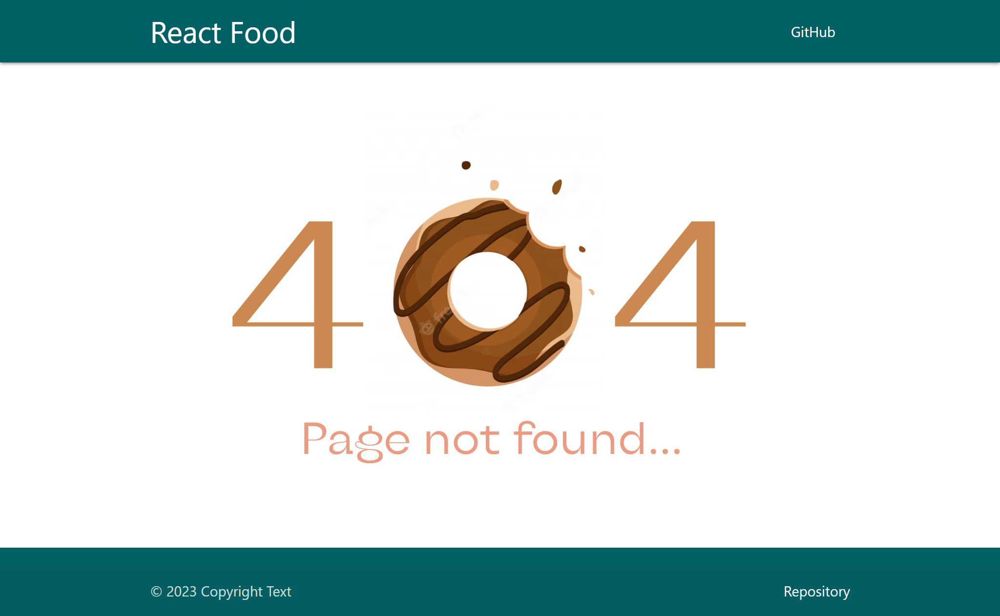

# React-Food

Простое приложение в котором я поработал с библиотекой React router dom. 
В приложении есть несколько страниц, по которым можно переходить без перезагрузки страницы.

На главной странице отображается каталог блюд с кнопкой "Посмотреть категорию".
Нажав на которую можно перейти на страницу выбранной категории. 
У каждого из блюд есть свой рецепт, который можно посмотреть нажав на кнопку "Посмотреть рецепт".

Так же на главной странице реализован поиск по категории блюд с использованием хука useSearchParams.
Возможность вернуться на предыдущую страницу реализована с помощью хука useNavigate.

## TheMealDB

Бесплатное API с рецептами блюд.
API - [TheMealDB](https://www.themealdb.com/api.php)

## css components

В качестве css компонентов был выбран фреймворк [Materialize](https://materializecss.com/).

Link to the project - [React-food](https://REBORNOFF.github.io/react-food-practice)

## Главная страница

## Страница с категориями

## Страница с рецепотом

## Поиск

## 404 страница

